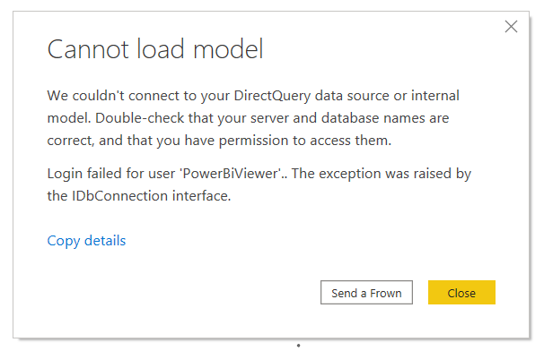
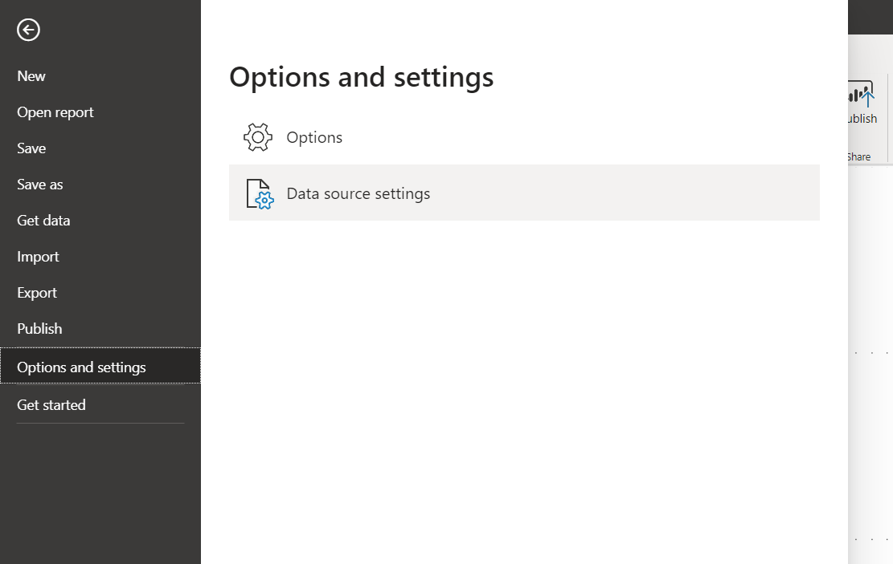
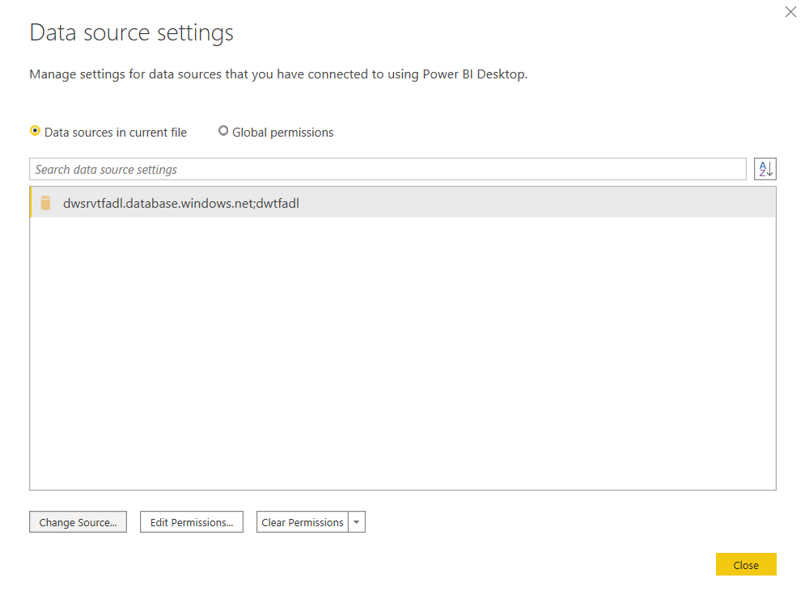
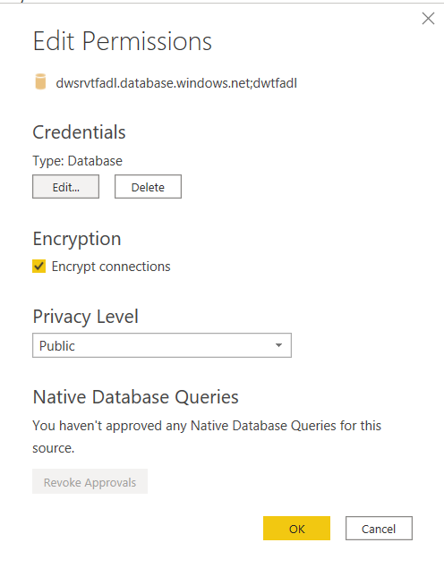
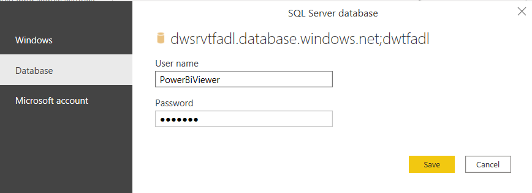
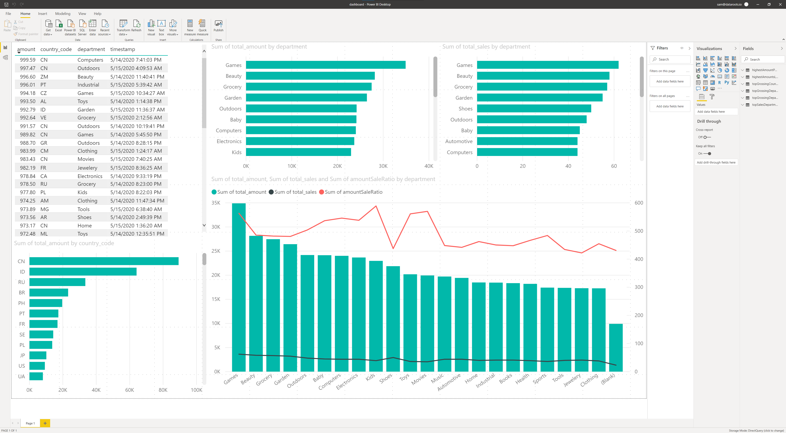

# Setting up the Power BI report

This Terraform module can deploy all resources automatically, except for the included Power BI report (there are no APIs available at the time of writing). In this walkthrough we'll connect the Azure Synapse Analytics instance to the Power BI report and publish it online.

The included Power BI report is meant to demonstrate the final step of the sample data pipeline that can optionally be provisioned with this module.

## Requirements

To follow this guide, you'll need a PC with Windows 10 and the Power BI app installed. The app can be downloaded [from the Microsoft Store](https://www.microsoft.com/en-us/p/power-bi-desktop/9ntxr16hnw1t).

You will also need a local copy of [the dashboard](assets/dashboard.pbix) that is included in this repository, which can be found in the `assets` folder.

## Deploying the module

The Terraform module has 4 output values you'll need to connect Power BI. You can use the module in your own Terraform configuration, or you can just deploy this repository. In the first case, you'll have to pass the output variables through and in the second case you will see them directly at the end of the deployment.

### Example

In this example we've named our data lake `tfadl`.

```
Apply complete! Resources: 50 added, 0 changed, 0 destroyed.

Outputs:
name = tfadl
powerbi_sql_dw_server_database = dwtfadl
powerbi_sql_dw_server_hostname = dwsrvtfadl.database.windows.net
powerbi_sql_dw_server_password = RQNX*H%&kav<UBuZ
powerbi_sql_dw_server_user = PowerBiViewer
```

## Connecting to the data source from Power BI

When you open the provided `dashboard.pbix`, you are greeted with an error messsage. This happens because Power BI tries to connect to the sample data lake we created in the example above, instead of the one you just created.



Click on **Close** and then open **Data source settings** in the **Options and settings** section of the **File** menu.



This opens a window listing all the configured data sources. There is just one source, so select it and click on **Change Source...**.



In the next window, change the **Server** to the value from `powerbi_sql_dw_server_hostname` and the **Database** to the value from `powerbi_sql_dw_server_database`. Confirm with **OK**.


Back on the previous screen, click on **Edit Permissions...**



In the screen that appears, you can click on the **Edit...** button to update the stored credentials.



Make sure to select **Database** on the left and then fill in the value from `powerbi_sql_dw_server_user` in **User name** the value from `powerbi_sql_dw_server_password` in **Password**.

Confirm with **Save**, **OK** and **Close**.

When you're back on the report page, click the **Refresh** button on the top and your data should start appearing in the premade charts.

## Publishing

The **Publish** button allows you to publish your report to Power BI online where you can share it with colleagues. You need a Power BI Pro license for this (a 60-day trial is available) and a Microsoft account provided by your company.

